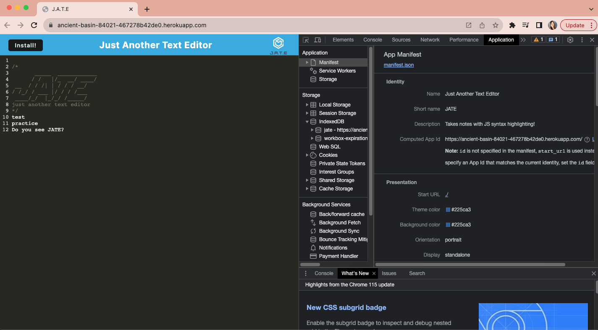
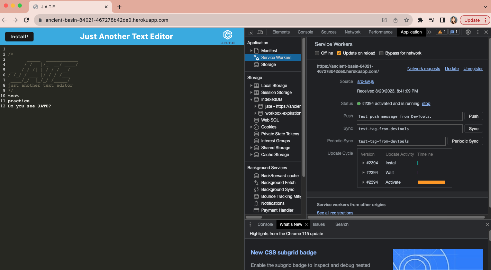
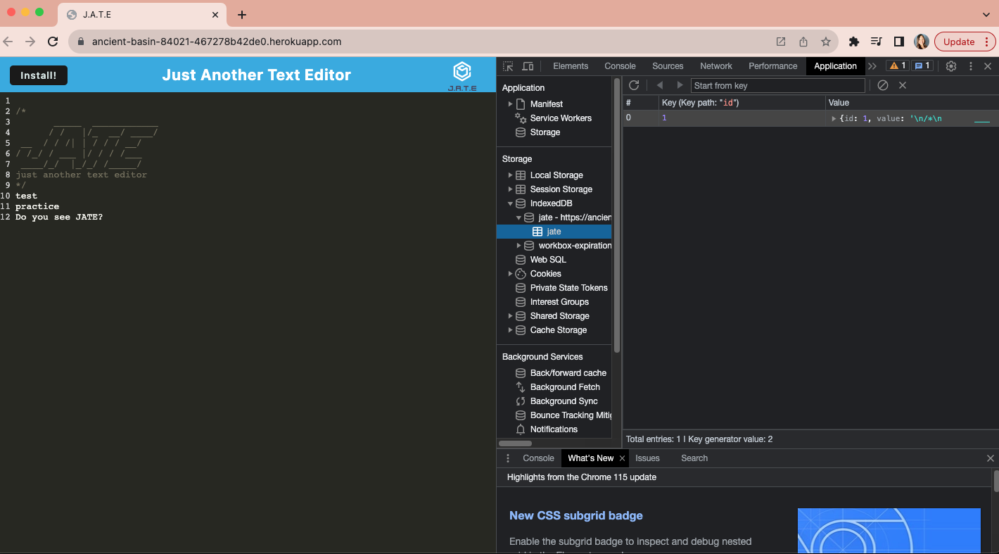

# Text Editor
> This app is a text editor that runs in the browser.  It is a single-page application that meets the PWA criteria.  It features a number of data persistence techniques that serve as redundancy in case one of the options is not supported by the browser.  It will also be able to function offline.
> Live demo [_here_](https://ancient-basin-84021-467278b42de0.herokuapp.com/). <!-- If you have the project hosted somewhere, include the link here. -->

## Table of Contents
* [General Info](#general-information)
* [Technologies Used](#technologies-used)
* [Features](#features)
* [Screenshots](#screenshots)
* [Setup](#setup)
* [Project Status](#project-status)
* [Acknowledgements](#acknowledgements)
* [Contact](#contact)
<!-- * [License](#license) -->

## General Information
By entering `npm run start:dev` from the root directory, this application starts up the backend and serves the client.  The text editor application will be run from the terminal and the JavaScript files will be bundled using webpack.  Webpack plugins will generate HTML file, service worker, and a manifest file.  While using next-gen JavaScript in the application, the text editor still functions in the browser correctly without any errors because of Babel.  The text editor can be opened up in the browser and the user can enter content, click off the DOM window or close it, and reopen it to find that the content has been saved and retrieved with IndexedDB.  The user can click on the icon of a square with an arrow pointing to the right corner which is to the right of the URL window to open the application or click install to download it.  Once the web application is loaded, the registered service worker using workbox will have static assets pre cached upon loading along with subsequent pages and static assets which allows for it to work offline.
<!-- You don't have to answer all the questions - just the ones relevant to your project. -->

## Technologies Used
- Babel
- Webpack
- idb
- Express
- Nodemon
- Concurrently

## Features
- Click on the icon of a square with an arrow pointing to the right corner which is to the right of the URL window to open the application or click install to download it.
- Content will be saved even after closing and reopening it.
- Application functions offline.

## Screenshots

<!-- If you have screenshots you'd like to share, include them here. -->

## Setup
In order to set up this app, enter `npm i` from the package.json in the  root, server, and the client to download dependencies and devDependencies.  Then, `npm run start:dev` to concurrently run the server and client.  Go to http://localhost:3000/ preferrably using an Incognito window or click on the Heroku link above.

## Project Status
Project is: _in progress_.

## Acknowledgements
- Many thanks to my instructor, Michael Pacheco, the TAs, Nirav and Julius, tutor Anastasia Warren, and all the AskBCS learning assistants.

## Contact
Created by Kristine Kim.  Feel free to contact me at kristinehkim@gmail.com!

<!-- Optional -->
<!-- ## License -->
<!-- This project is open source and available under the [... License](). -->

<!-- You don't have to include all sections - just the one's relevant to your project -->